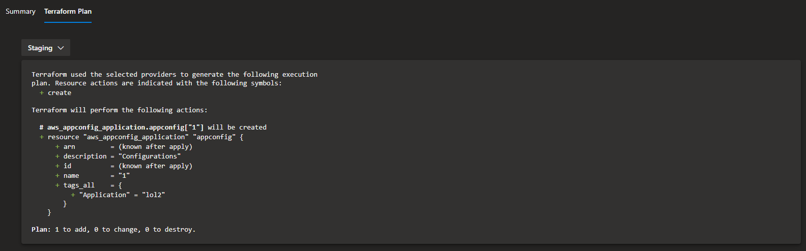

# Azure Pipelines - Terraform Output

A small plugin that brings a Terraform Plan window into the pipeline and release results.

The plugin is available on the [Visual Studio Marketplace](https://marketplace.visualstudio.com/items?itemName=JaydenMaalouf.terraform-output).

## Usage

Simply call the Terraform Output task with the appropriate inputs:

```yaml
- task: TerraformOutput@1
  inputs:
    outputFilePath: example.tfplan
    artifactName: Staging
```

If you have multiple output files, you can use glob pattern matching to pickup all outputs:

```yaml
- task: TerraformOutput@1
  inputs:
    useGlobPattern: true
```

#### Inputs

The following inputs are available to override:

| Input             | Type     | Default                                         | Description                                                                                         |
| ----------------- | -------- | ----------------------------------------------- | --------------------------------------------------------------------------------------------------- |
| useGlobPattern    | boolean  | false                                           | Whether to use a search pattern to find output files                                                |
| outputFilePattern | string   | \*\*_/_\*.tfplan                                | File pattern used to find output files (only visible if useGlobPattern is true)                     |
| searchDirectory   | string   | $(System.DefaultWorkingDirectory)               | Directory the file search should start (only visible if useGlobPattern is true)                     |
| inferArtifactName | boolean  | false                                           | Infer artifact name from outputFilePath filename (only visible if useGlobPattern is false)          |
| outputFilePath    | filePath | $(System.DefaultWorkingDirectory)/output.tfplan | File path of the outfile file (only visible if useGlobPattern is false)                             |
| artifactName      | string   |                                                 | Artifact name used in the dropdown (only visible if useGlobPattern and inferArtifactName are false) |

## Results

A new tab will be available in the results view:

| Pipelines              | Releases               |
| ---------------------- | ---------------------- |
|  |  |

### Select your output file

In the Terraform Plan tab, your associated Terraform Output artifacts will appear in the dropdown box.

The dropdown box is unique to each build, so it won't show previous build artifacts:


Once you have selected your state file, it will show your plan output:



## Troubleshooting

### Error: Failed to load plugin schemas

Issue - you get the following error when running the Terraform Load Output task:

> Error while loading schemas for plugin components: Failed to obtain provider schema: Could not load the schema for provider registry.terraform.io/hashicorp/azurerm: failed to instantiate provider "registry.terraform.io/hashicorp/azurerm" to obtain schema: unavailable provider "registry.terraform.io/hashicorp/azurerm"..

**Problem**

You are not saving your `.tfplan` file in the directory that contains your Terraform code. For example doing the folowing in an Azure DevOps release **will not work**:

```
# DOES NOT WORK!
$(System.DefaultWorkingDirectory)/example.tfplan
```

**Solution**

Save your tfplan in the directory that contains your Terraform code, i.e. the same directory that you have configured for your `terraform init`. For example doing the folowing in an Azure DevOps release **will work**:

```
# `tf init` was done on $(System.DefaultWorkingDirectory)/Terraform-v2/drop/foobarproject/environments/dev08
$(System.DefaultWorkingDirectory)/Terraform-v2/drop/foobarproject/environments/dev08/example.tfplan
```
