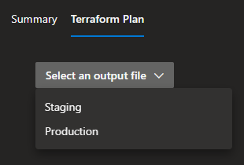

# Azure Pipelines - Terraform Output

A small plugin that brings a Terraform Plan window into the pipeline and release results  
The plugin is available on the Visual Studio Marketplace [here](https://marketplace.visualstudio.com/items?itemName=JaydenMaalouf.terraform-output)

## Usage

Simply call the Terraform Output task with the appropriate inputs

```yaml
- task: TerraformOutput@1
  inputs:
    outputFilePath: example.tfplan
    artifactName: Staging
```

If you have multiple output files, you can use glob pattern matching to pickup all outputs

```yaml
- task: TerraformOutput@1
  inputs:
    useGlobPattern: true
```

#### Inputs

The following inputs are available to override

| Input              | Type               | Description               |
| ---------------------- | ---------------------- | ---------------------- |
| useGlobPattern | boolean | Whether to use a search pattern to find output files |
| outputFilePattern | string | File pattern used to find output files (only visible if useGlobPattern is true) |
| searchDirectory | string | Directory the file search should start (only visible if useGlobPattern is true) |
| inferArtifactName | boolean | Infer artifact name from outputFilePath filename (only visible if useGlobPattern is false) |
| outputFilePath | filePath | File path of the outfile file (only visible if useGlobPattern is false) |
| artifactName | string | Artifact name used in the dropdown (only visible if useGlobPattern and inferArtifactName are false) |

## Results

A new tab will be available in the results view

| Pipelines              | Releases               |
| ---------------------- | ---------------------- |
|  |  |

### Select your output file

In the Terraform Plan tab, your associated Terraform Output artifacts will appear in the dropdown box  
The dropdown box is unique to each build, so it won't show previous build artifacts  


Once you have selected your state file, it will show your plan output

